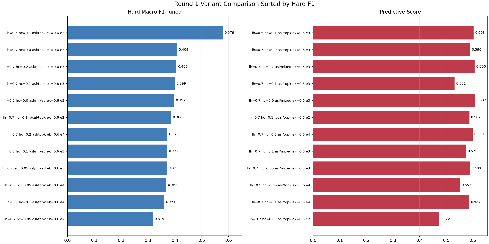
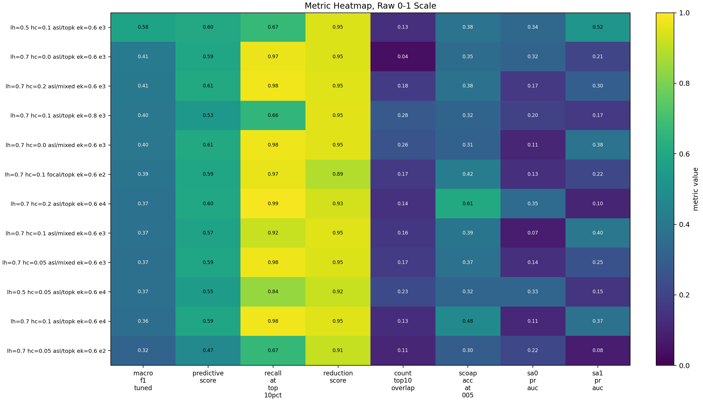
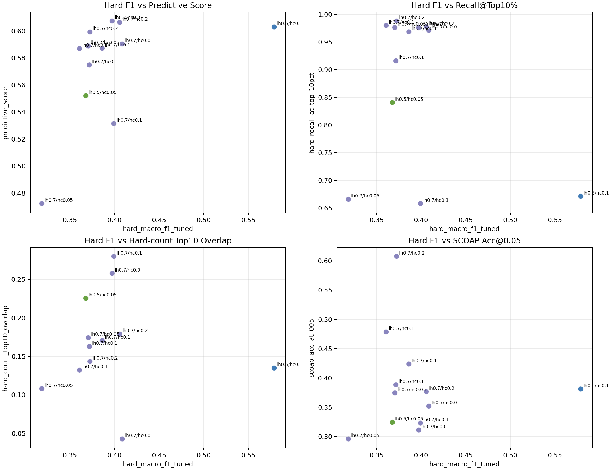
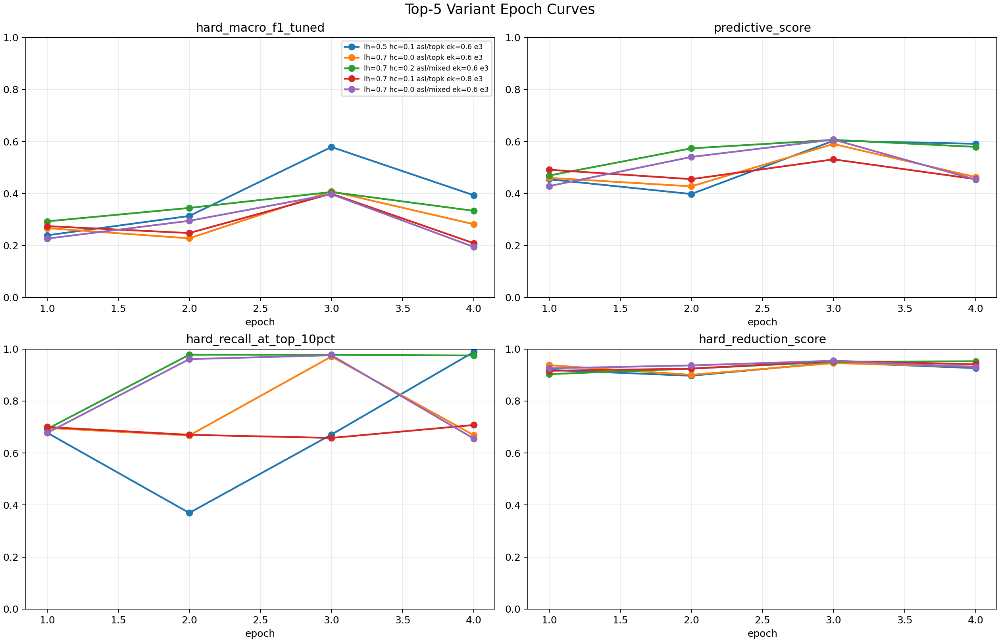

# TPI-JEPA Hard-F1 AutoResearch Report

> 目标：让读者快速理解这个项目在做什么、为什么这样做、已经探索了哪些技术路线、每条路线效果如何，以及下一步该往哪里走。

## 0. Research Thesis

本项目主推的技术路线是：

```text
用 hard 故障节点预测作为自监督/辅助监督信号，
迫使 JEPA world model 学会电路中“故障可测性”的隐式表征。
```

也就是说，我们不是只训练模型预测 test coverage 的最终数值，而是让模型在 node-level 上理解：

```text
哪些节点更可能承载难检测 stuck-at faults
哪些节点的 hard fault 会被某个 test point action 影响
哪些 action 会减少 hard faults
哪些 action 只是表面上提升局部 proxy，但不能真正改善可测性
```

这一点是当前项目区别于普通 GNN / 普通 coverage regression 的核心。

### 核心假设

传统 testability proxy，例如 SCOAP，只能提供静态、局部、启发式的可控/可观测难度。真实 ATPG / fault simulation 中的 hard faults 受到以下因素共同影响：

- gate type 和逻辑功能
- fanin/fanout cone
- reconvergence
- action 与 hard fault node 的相对位置
- 已插入 test points 的状态
- fault propagation path
- 电路级结构分布

因此，如果 world model 只学习 `delta_test_coverage`，监督信号太稀疏、太晚、太 graph-level；模型容易学到粗糙排序，却学不到可泛化的 hard-fault 表征。

本项目改为显式加入：

```text
node-level hard SA0 / SA1 prediction
node-level hard fault count prediction
graph/action-level hard reduction prediction
pairwise hard ranking
```

目的是让 latent state 中出现更强的 **fault-testability representation**。

## 1. 项目一句话

本项目在训练一个 **TPI-JEPA world model**，用于学习电路中插入 test point 后的状态变化，并重点提升 **hard fault node 的识别能力**。

当前最核心的优化目标是：

```text
hard_macro_f1_tuned
```

也就是对 hard SA0 / hard SA1 节点预测结果做阈值调优后的 macro F1。

## 1.1 要解决的问题

本项目面向的是 test point insertion / DFT 优化中的一个关键问题：

```text
如何在不每次都调用昂贵 ATPG / fault simulation 的情况下，
预测某个 test point action 对 hard faults 和故障可测性的影响？
```

具体地，给定一个电路和当前已经插入的 test points，模型需要对一个候选 action 做预测：

```text
action = 在某个 node 插入 control0 / control1 / observe test point
```

希望模型学会：

1. 预测 action 后哪些 node 仍然是 hard fault node。
2. 预测 hard fault count 的变化。
3. 预测 graph-level hard fault reduction。
4. 为 planner 提供更好的候选排序。

最终服务于：

```text
更少仿真成本
更好的 test point candidate selection
更高 hard fault 覆盖
```

## 1.2 为什么 hard F1 是当前主指标

早期实验发现，模型可以取得较高：

```text
hard_recall_at_top_10pct
predictive_score
```

但 hard F1 很低。这意味着模型会把一批疑似 hard nodes 排到前面，但无法稳定地区分真正 hard / non-hard 节点。

对于 planner 来说，这会导致：

- top-k 候选可能覆盖 hard 区域，但噪声很大。
- 阈值或分类边界不可靠。
- action value 容易被 false positives 干扰。

因此当前阶段把主目标设为：

```text
hard_macro_f1_tuned
```

它更直接衡量模型是否真的学会 hard fault node 的可测性表征。

## 2. 当前系统在做什么

### 2.1 输入

模型输入是一张 BENCH 电路图：

- 节点：gate / net
- 边：fanin -> fanout
- 节点特征：
  - gate type one-hot
  - structural features
  - SCOAP proxy
  - testability region features
  - 已插入 test point action mask
  - 可选 real fault / activation priors

关键代码：

```text
tpi_jepa/graph.py
tpi_jepa/features.py
tpi_jepa/dataset.py
```

### 2.2 模型

当前模型是一个 JEPA-style world model：

```text
current circuit state + candidate action
        ->
online encoder
        ->
action-conditioned dynamics
        ->
predicted next latent state
        ->
multiple heads
```

主要 heads：

| Head | 作用 |
|---|---|
| `scoap_head` | 预测下一状态 SCOAP |
| `delta_scoap_head` | 预测 SCOAP 变化 |
| `hard_head` | 预测 node-level hard SA0 / SA1 |
| `hard_count_head` | 预测 node-level hard fault count |
| `hard_reduction_head` | 预测 graph/action-level hard fault reduction |
| `reward_head` | 保留 coverage/reward 弱目标 |

关键代码：

```text
tpi_jepa/model.py
tpi_jepa/train.py
```

### 2.4 主推机制：hard fault representation learning

当前训练不再只依赖单一 world-model latent loss，而是多任务训练：

| 监督信号 | 粒度 | 目的 |
|---|---|---|
| JEPA latent target | node latent | 学习 action 后状态转移 |
| SCOAP / delta-SCOAP | node feature | 保持传统 testability proxy |
| hard SA0 / SA1 | node classification | 学习真实 hard fault node 表征 |
| hard fault count | node regression/ranking | 学习 hard fault 严重程度 |
| hard reduction | graph/action regression | 学习 action 是否减少 hard faults |
| pairwise hard ranking | node pair | 推高 hard/high-count node 分数 |

主推观点：

```text
hard node prediction 不是最终应用本身，
而是让 world model latent 对“故障可测性”敏感的训练机制。
```

如果这个机制成立，模型不仅能提升 hard F1，也应当改善 planner 对 candidate action 的排序。

### 2.3 验证协议

普通单 seed autoresearch variant 在同一次运行中使用同一套数据切分：

```text
same labels
same seed
same train_frac / val_frac
same excluded eval protocol
same max_nodes
split_by_benchmark(...)
```

因此同一轮内不同技术路线的横向比较是公平的。

多 seed 稳定性复验是例外：它故意改变 `seed`，用于估计 split / initialization 波动。此时不把单个 variant 当成最终结论，而看同一配置 across seeds 的均值、方差和 paired seed 差异。

## 3. AutoResearch 方法

AutoResearch 当前不是盲目训练一个模型，而是：

```text
生成候选配置
    ->
训练每个 variant
    ->
评估 checkpoint
    ->
按 objective 选最优 epoch / 最优 variant
    ->
写 results.tsv / summary.md / best.pt
```

关键脚本：

```text
scripts/run_predictive_autoresearch.py
scripts/evaluate_hard_checkpoints.py
```

当前主要 objective：

```text
--objective hard_f1
```

对应指标：

```text
hard_macro_f1_tuned
```

评估脚本还记录：

| 指标 | 含义 |
|---|---|
| `hard_macro_f1_tuned` | hard SA0/SA1 tuned macro F1，当前主目标 |
| `predictive_score` | 综合分，包含 hard F1、top10 recall、reduction、count overlap、SCOAP |
| `hard_recall_at_top_10pct` | top 10% predicted hard nodes 覆盖真实 hard nodes 的比例 |
| `hard_reduction_score` | hard reduction 预测质量 |
| `hard_count_top10_overlap` | hard count top-k 排序重合度 |
| `hard_sa0_pr_auc` / `hard_sa1_pr_auc` | hard SA0/SA1 ranking 质量 |

## 4. 已探索技术路线

### 4.1 第一阶段：配置级 hard-fault 预训练搜索

目录：

```text
autoresearch/predictive-main-260625-121136
```

当时主要探索：

- `lambda_hard`
- `lambda_hard_count`
- `lambda_hard_reduction`
- `hard_negative_sample_ratio`
- `feature_mode`
- `edge_weight_mode`
- `edge_keep_ratio`

代表结果：

| 目标 | 最佳值 |
|---|---:|
| best `predictive_score` | `0.6126` |
| 对应 `hard_macro_f1_tuned` | `0.0708` |
| 该轮最高 hard F1 | `0.1625` |

结论：

- 旧 BCE / MLP head 路线能把 top10 recall 做高，但 hard F1 很弱。
- 说明模型有一定排序能力，但阈值分类能力不足。
- 需要改 head、loss 和 hard negative 学习方式。

### 4.2 第二阶段：head / loss / negative mining / sampler 技术搜索

目录：

```text
autoresearch/predictive-260625-154634
```

这一轮引入：

| 技术 | 搜索内容 |
|---|---|
| Head | `mlp` vs `residual_context` |
| Loss | `BCE` vs `Focal` vs `ASL` |
| Negative mining | `random` vs `mixed` vs `topk` |
| Train sampling | `shuffle` vs `hard_weighted` |
| Evaluation | 更细的 threshold search |

最佳结果：

| 指标 | 值 |
|---|---:|
| `hard_macro_f1_tuned` | `0.5788` |
| `predictive_score` | `0.6030` |
| `best_epoch` | `3` |
| `hard_recall_at_top_10pct` | `0.6711` |
| `hard_reduction_score` | `0.9480` |

最佳配置：

```text
lambda_hard           = 0.5
lambda_hard_count     = 0.1
lambda_hard_reduction = 0.5
hard_loss             = ASL
hard_head_type        = residual_context
hard_negative_mining  = topk
train_sample_strategy = hard_weighted
feature_mode          = testability
edge_weight_mode      = fault_path
edge_keep_ratio       = 0.6
```

当前全局冠军 checkpoint：

```text
autoresearch/predictive-260625-154634/best.pt
```

重要结论：

- **ASL 明显优于 Focal / BCE**。
- **`residual_context` hard head 有效**，说明 action/cone relation context 对 hard fault 预测有帮助。
- **top-k hard negative mining 是当前最有效的负样本策略**。
- **hard-weighted sampling 保持为默认策略**。
- `lambda_hard=0.5` 比 `0.7` 更好，hard 分类 loss 太重会影响其他辅助表征。

这一阶段验证了主推假设的一部分：

```text
当训练明确要求模型预测 hard fault node，
并用 ASL + top-k hard negative mining 处理极端正负不平衡时，
hard F1 可以从早期的约 0.07-0.16 提升到 0.5788。
```

这说明 node-level hard fault supervision 对 world model 表征是有效信号。

本轮图表：









### 4.3 第三阶段：围绕冠军点做细扫

目录：

```text
autoresearch/predictive-hardf1-round2-260625-1705
```

这一轮固定主要技术路线：

```text
ASL + residual_context + topk mining + hard_weighted sampling
```

细扫：

- `lambda_hard`
- `lambda_hard_count`
- `edge_keep_ratio`

最佳结果：

| 指标 | 值 |
|---|---:|
| `hard_macro_f1_tuned` | `0.4822` |
| `predictive_score` | `0.6294` |
| `best_epoch` | `2` |
| `hard_recall_at_top_10pct` | `0.9821` |

最佳配置：

```text
lambda_hard       = 0.5
lambda_hard_count = 0.12
edge_keep_ratio   = 0.6
```

结论：

- 第二轮没有超过第一轮 hard F1 冠军。
- 但第二轮最佳的 `predictive_score` 和 `hard_recall_at_top_10pct` 更高。
- 这说明 `lambda_hard_count=0.12` 让模型更擅长排序和找 hard nodes，但阈值分类 F1 没有第一轮那次高。
- 同一配置复跑波动明显，说明需要多 seed / 多次复跑判断真实提升。

关键洞察：

```text
第一轮冠军：hard F1 更高
第二轮冠军：top10 recall / predictive score 更高
```

这两个候选都值得保留。

### 4.3.1 稳定性复验：A/B 单 seed 复跑

目录：

```text
autoresearch/stability-hardf1-260625-gpu1
```

目的：

```text
复验第一轮 hard F1 冠军附近的两个核心候选：
A: lambda_hard=0.5, lambda_hard_count=0.1
B: lambda_hard=0.5, lambda_hard_count=0.12
```

固定配置：

```text
hard_loss=asl
hard_head_type=residual_context
hard_negative_mining=topk
train_sample_strategy=hard_weighted
encoder_type=mean
summary_mode=global
edge_weight_mode=fault_path
edge_keep_ratio=0.6
```

结果：

| Config | hard F1 | predictive | best epoch | 备注 |
|---|---:|---:|---:|---|
| `lambda_hard_count=0.10` | `0.3555` | `0.5231` | `3` | 本次 A/B 最佳 |
| `lambda_hard_count=0.12` | `0.3278` | `0.4882` | `4` | 未复现第二轮高分 |

结论：

- 本次复跑没有复现第一轮冠军 `0.5788`，也没有复现第二轮 `0.4822`。
- `0.5/0.1` 在这次复跑中优于 `0.5/0.12`。
- 这进一步确认 seed / 训练随机性是当前主要风险之一。
- 后续不应再根据单次 run 判断路线优劣；至少需要 3 seeds 均值和方差。

### 4.3.2 稳定性复验：5-seed A/B 复跑

目录：

```text
autoresearch/stability-hardf1-seeds-2026-2030
```

目的：

```text
在同一实现、同一训练预算、同一评估协议下，
比较 lambda_hard_count=0.10 与 0.12 的真实稳定性。
```

固定配置：

```text
lambda_hard           = 0.5
lambda_hard_reduction = 0.5
lambda_hard_rank      = 0.0
encoder_type          = mean
summary_mode          = global
hard_loss             = ASL
hard_head_type        = residual_context
hard_negative_mining  = topk
train_sample_strategy = hard_weighted
feature_mode          = testability
edge_weight_mode      = fault_path
edge_keep_ratio       = 0.6
seeds                 = 2026, 2027, 2028, 2029, 2030
```

汇总结果：

| `lambda_hard_count` | n | mean hard F1 | std | min | max | mean predictive | mean top10 recall |
|---:|---:|---:|---:|---:|---:|---:|---:|
| `0.10` | 5 | `0.6468` | `0.1636` | `0.4245` | `0.7963` | `0.7110` | `0.8938` |
| `0.12` | 5 | `0.6453` | `0.1554` | `0.4401` | `0.7949` | `0.7131` | `0.8878` |

逐 seed paired 对比：

| seed | hc=0.10 hard F1 | hc=0.12 hard F1 | `0.10 - 0.12` |
|---:|---:|---:|---:|
| `2026` | `0.4245` | `0.4401` | `-0.0156` |
| `2027` | `0.7785` | `0.7876` | `-0.0092` |
| `2028` | `0.7640` | `0.7287` | `+0.0353` |
| `2029` | `0.4708` | `0.4751` | `-0.0043` |
| `2030` | `0.7963` | `0.7949` | `+0.0013` |

本轮最佳单点：

```text
checkpoint:
autoresearch/stability-hardf1-seeds-2026-2030/best.pt

variant:
seed2030, lambda_hard_count=0.10

hard_macro_f1_tuned = 0.7963
predictive_score    = 0.8197
best_epoch          = 4
```

结论：

- `lambda_hard_count=0.10` 与 `0.12` 的均值几乎一致：`0.6468` vs `0.6453`。
- 两者的标准差都很大，约 `0.16`，说明 seed / split 波动是当前主要矛盾。
- paired seed 差异很小，最大只有 `+0.0353`，说明继续在 `0.10` vs `0.12` 上做单点调参价值有限。
- 5-seed 均值已经高于旧单次冠军 `0.5788`，说明第一轮高分不是孤立偶然；主线配置确实有效。
- 但低 seed 仍会掉到 `0.42-0.48`，后续必须重点解决稳定性、阈值校准和 action-level 对齐。

### 4.4 第四阶段：论文启发的新 GNN / 电路表征路线

参考文献方向：

| 论文线索 | 启发 |
|---|---|
| DeepGate | 电路图不应当只按普通图建模，应尊重逻辑传播方向 |
| DeepGate2 | 可加入功能相似 / 差异监督，节点 embedding 应包含逻辑功能信息 |
| DeepSeq / DeepSeq2 | 可将结构、功能、testability 表征分离 |
| DeepGate3 | 长距离 cone / subcircuit 信息可能需要更强 pooling 或 transformer |
| CircuitGNN / NetlistGNN | gate type、edge direction、stage/cone 信息都应显式编码 |

已落地为三个新技术开关：

| 新技术 | 配置字段 | 代码位置 | 目的 |
|---|---|---|---|
| Gate/direction-aware encoder | `encoder_type=gate_dir` | `tpi_jepa/model.py` | 用 gate embedding + fanin/fanout 分离消息增强电路结构表征 |
| Cone-aware summary | `summary_mode=cone` | `tpi_jepa/model.py` | graph/action head 不只看全图 mean，而看 action fanin/fanout/cone pooled latent |
| Pairwise hard ranking loss | `lambda_hard_rank` | `tpi_jepa/train.py` | 让 hard / high-count 节点分数高于 easy nodes |

当前新技术路线目录：

```text
autoresearch/predictive-tech-routes-260625-rerun
```

当前已有部分结果：

| Route | `lambda_hard_rank` | `encoder_type` | `summary_mode` | hard F1 | predictive |
|---|---:|---|---|---:|---:|
| gate-dir + cone + ranking | `0.05` | `gate_dir` | `cone` | `0.3720` | `0.5908` |
| gate-dir + cone, no ranking | `0.0` | `gate_dir` | `cone` | `0.2618` | `0.5210` |

阶段性判断：

- 新技术路线目前还没有超过旧冠军。
- `lambda_hard_rank=0.05` 比 `0.0` 明显好，说明 pairwise ranking loss 有正向信号。
- 但 `gate_dir + cone` 当前 hard F1 不够高，可能需要：
  - 单独测试 `mean + cone`
  - 单独测试 `gate_dir + global`
  - 调低 ranking weight
  - 让 gate_dir encoder 多训练或降低 lr

### 4.4.1 Clean gate/cone/rank 消融

目录：

```text
autoresearch/predictive-tech-ablation-260626
```

目的：

```text
拆解 gate_dir、cone summary、hard_rank，判断它们是否应进入主线。
```

固定基线：

```text
lambda_hard=0.5
lambda_hard_count=0.10
lambda_hard_reduction=0.5
hard_loss=ASL
hard_head_type=residual_context
hard_negative_mining=topk
train_sample_strategy=hard_weighted
edge_weight_mode=fault_path
edge_keep_ratio=0.6
```

消融矩阵：

```text
encoder_type in {mean, gate_dir}
summary_mode in {global, cone}
lambda_hard_rank in {0.0, 0.03, 0.05}
```

本轮结果 top 6：

| Rank | encoder | summary | rank weight | hard F1 | predictive | top10 recall | hard reduction |
|---:|---|---|---:|---:|---:|---:|---:|
| 1 | `mean` | `cone` | `0.05` | `0.3918` | `0.5345` | `0.7402` | `0.9241` |
| 2 | `mean` | `cone` | `0.00` | `0.3899` | `0.5748` | `0.8827` | `0.9552` |
| 3 | `mean` | `global` | `0.00` | `0.3872` | `0.5502` | `0.8075` | `0.9566` |
| 4 | `mean` | `global` | `0.05` | `0.3748` | `0.5170` | `0.7010` | `0.9436` |
| 5 | `mean` | `global` | `0.03` | `0.3211` | `0.5614` | `0.9772` | `0.9355` |
| 6 | `mean` | `cone` | `0.03` | `0.3081` | `0.4968` | `0.7228` | `0.9514` |

本轮 baseline 对照：

```text
mean + global + rank=0.0
hard_macro_f1_tuned = 0.3872
predictive_score    = 0.5502
```

最佳 F1 相对 baseline：

```text
mean + cone + rank=0.05
delta hard F1      = +0.0046
delta predictive   = -0.0157
```

最佳 predictive 相对 baseline：

```text
mean + cone + rank=0.0
delta hard F1      = +0.0027
delta predictive   = +0.0246
```

结论：

- 没有任何组件达到 plan 设定的 keep rule：`hard F1` 或 `predictive_score` 至少提升 `0.03`。
- `gate_dir` 全部偏弱，最好只有 `0.3013`，当前不应进入主线。
- `cone` 在 `mean` encoder 下略微提高本轮 F1 或 predictive，但幅度不足，不值得做 5-seed 复验。
- `hard_rank` 没有稳定正收益：`rank=0.05` 在 `mean+cone` 下提高 F1，但降低 predictive；在 `mean+global` 下也低于 no-rank。

按 stop rule：

```text
冻结 encoder_type=mean
冻结 summary_mode=global
冻结 lambda_hard_rank=0.0
下一步进入 calibration diagnostics + action-level ranking
```

### 4.4.2 Calibration / action-ranking diagnostics

目录：

```text
autoresearch/diagnostics-calibration-action-260626
```

目的：

```text
不训练新模型，只用已有 mean/global/no-rank checkpoint 生成可解释诊断报告。
```

新增 evaluator 参数：

```text
--diagnostics-dir
--write-calibration-diagnostics
--write-action-ranking-diagnostics
--calibration-bins
--action-score-field
--min-action-group-size
```

新增输出：

| File | 内容 |
|---|---|
| `thresholds_by_class.tsv` | SA0/SA1 tuned threshold、F1、Brier、ECE、FP/FN rate |
| `threshold_sweep.tsv` | 阈值从 0 到 1 的 precision/recall/F1 曲线 |
| `calibration_bins.tsv` | calibration reliability bins |
| `per_benchmark_metrics.tsv` | benchmark 级 hard F1 / threshold / calibration |
| `bucket_metrics.tsv` | 按节点规模、hard-positive-rate、action type 分桶 |
| `action_ranking_metrics.tsv` | action group 内 pairwise accuracy、NDCG、top1 hit |
| `action_group_examples.tsv` | action 排序成功/失败案例 |
| `calibration_action_diagnostics.md` | 汇总诊断报告 |

本次诊断命令：

```bash
python scripts/evaluate_hard_checkpoints.py \
  --config autoresearch/stability-hardf1-seeds-2026-2030/configs/seed2026__lh0p5__lhc0p1__lhr0p5__lhrk0p0__encmean__sumglobal__hlasl__hhresidual_context__pw20__ns5__nmtopk__tshard_weighted__fmtestability__ewfault_path__ek0p6__fc0p0.json \
  --run-dir autoresearch/stability-hardf1-seeds-2026-2030/runs/seed2026__lh0p5__lhc0p1__lhr0p5__lhrk0p0__encmean__sumglobal__hlasl__hhresidual_context__pw20__ns5__nmtopk__tshard_weighted__fmtestability__ewfault_path__ek0p6__fc0p0 \
  --out-csv autoresearch/diagnostics-calibration-action-260626/target_metrics.csv \
  --out-png autoresearch/diagnostics-calibration-action-260626/target_metrics.png \
  --diagnostics-dir autoresearch/diagnostics-calibration-action-260626 \
  --write-calibration-diagnostics \
  --write-action-ranking-diagnostics \
  --calibration-bins 10 \
  --action-score-field hard_reduction_total \
  --min-action-group-size 2 \
  --max-val-samples 512 \
  --max-steps 128 \
  --device cpu
```

注意：

```text
这是有限诊断运行，max_steps=128，数值不能直接替代完整 5-seed 评估。
它用于定位 calibration/action-ranking 问题，不用于声明新模型效果。
```

诊断结果：

| 指标 | 值 |
|---|---:|
| checkpoint count | `6` |
| best limited-eval hard F1 | `0.2666` |
| mean ECE SA0 | `0.1827` |
| mean ECE SA1 | `0.4578` |
| comparable action groups | `6` |
| mean action pairwise acc | `0.4333` |
| mean action NDCG@10 | `0.0000` |
| mean action top1 hit | `0.0000` |

阶段性判断：

- Calibration 问题明显，尤其 SA1 ECE 很高。
- 本次有限 action group 上，`hard_reduction_pred[0]` 的 action 排序信号弱，不应立即上 action-ranking loss。
- 下一步应先做 calibration / threshold / benchmark-bucket 诊断的完整化，再决定 action-ranking loss 的训练目标。

### 4.4.3 Calibration policy comparison

目录：

```text
autoresearch/calibration-policy-260626
```

目的：

```text
不训练新模型，比较不同 hard-node 阈值策略是否能解释或提升 hard F1。
```

新增 evaluator 参数：

```text
--write-calibration-policy-report
--calibration-policy
--benchmark-threshold-shrinkage
```

新增输出：

| File | 内容 |
|---|---|
| `calibration_mode_metrics.tsv` | 每个 checkpoint × threshold policy 的聚合 hard F1 / FP / FN / ECE |
| `per_benchmark_calibrated_metrics.tsv` | 每个 benchmark 在各 threshold policy 下的 hard F1 |
| `threshold_policy_comparison.tsv` | policy 相对 class-tuned / 0.5 threshold 的差值与 promote/reject 判断 |
| `calibration_mode_report.md` | 可读结论报告 |

本次诊断命令：

```bash
python scripts/evaluate_hard_checkpoints.py \
  --config autoresearch/stability-hardf1-seeds-2026-2030/configs/seed2026__lh0p5__lhc0p1__lhr0p5__lhrk0p0__encmean__sumglobal__hlasl__hhresidual_context__pw20__ns5__nmtopk__tshard_weighted__fmtestability__ewfault_path__ek0p6__fc0p0.json \
  --run-dir autoresearch/stability-hardf1-seeds-2026-2030/runs/seed2026__lh0p5__lhc0p1__lhr0p5__lhrk0p0__encmean__sumglobal__hlasl__hhresidual_context__pw20__ns5__nmtopk__tshard_weighted__fmtestability__ewfault_path__ek0p6__fc0p0 \
  --out-csv autoresearch/calibration-policy-260626/target_metrics.csv \
  --out-png autoresearch/calibration-policy-260626/target_metrics.png \
  --diagnostics-dir autoresearch/calibration-policy-260626 \
  --write-calibration-policy-report \
  --calibration-bins 10 \
  --max-val-samples 512 \
  --max-steps 128 \
  --device cpu
```

结果：

| Policy | hard F1 | delta vs class-tuned | 判断 |
|---|---:|---:|---|
| `class_tuned` | `0.2666` | `0.0000` | neutral |
| `benchmark_tuned` | `0.2666` | `0.0000` | neutral |
| `benchmark_shrinkage_{0.25,0.5,0.75}` | `0.2666` | `0.0000` | neutral |
| `global_0p5` | `0.0344` | `-0.2321` | reject |

阶段性判断：

- 当前 hard head 的 raw probability 不能用固定 `0.5` 阈值，必须继续使用 validation class-tuned threshold。
- 在本次有限采样里，benchmark-tuned 和 shrinkage policy 没有超过 class-tuned，不能作为新主线。
- 这说明短期不应把精力放在复杂 post-hoc threshold policy；更应该改善概率校准、类别边界和验证协议覆盖。
- 本轮只用 `max_steps=128`，且采样里 benchmark 覆盖有限；结论用于确定工具链和方向，不替代完整验证。

### 4.4.4 Hard-head calibration loss

目录：

```text
autoresearch/calibration-loss-smoke-260626
```

目的：

```text
实现训练期 hard-head calibration loss，并在训练前先用 temperature scaling 诊断校准空间。
```

代码改动：

| File | 改动 |
|---|---|
| `tpi_jepa/train.py` | 新增 `lambda_hard_brier`、`lambda_hard_soft_f1`、`hard_soft_f1_eps` |
| `scripts/evaluate_hard_checkpoints.py` | 新增 `hard_macro_f1_at_0p5`、temperature-scaled ECE/Brier 诊断 |
| `scripts/run_predictive_autoresearch.py` | 新增 calibration loss / ASL gamma / ASL clip sweep 参数 |

新增训练配置：

```text
lambda_hard_brier
lambda_hard_soft_f1
hard_soft_f1_eps
```

新增 evaluator 参数：

```text
--temperature-scale-hard
--temperature-grid
--write-hard-calibration-report
```

新增 runner 参数：

```text
--lambda-hard-briers
--lambda-hard-soft-f1s
--hard-asl-gamma-negs
--hard-asl-clips
--center-lambda-hard-brier
--center-lambda-hard-soft-f1
```

smoke diagnostic 命令：

```bash
python scripts/evaluate_hard_checkpoints.py \
  --config autoresearch/stability-hardf1-seeds-2026-2030/configs/seed2026__lh0p5__lhc0p1__lhr0p5__lhrk0p0__encmean__sumglobal__hlasl__hhresidual_context__pw20__ns5__nmtopk__tshard_weighted__fmtestability__ewfault_path__ek0p6__fc0p0.json \
  --run-dir autoresearch/stability-hardf1-seeds-2026-2030/runs/seed2026__lh0p5__lhc0p1__lhr0p5__lhrk0p0__encmean__sumglobal__hlasl__hhresidual_context__pw20__ns5__nmtopk__tshard_weighted__fmtestability__ewfault_path__ek0p6__fc0p0 \
  --out-csv autoresearch/calibration-loss-smoke-260626/target_metrics.csv \
  --out-png autoresearch/calibration-loss-smoke-260626/target_metrics.png \
  --diagnostics-dir autoresearch/calibration-loss-smoke-260626 \
  --write-calibration-diagnostics \
  --write-hard-calibration-report \
  --temperature-scale-hard \
  --temperature-grid 0.5,0.75,1.0,1.25,1.5,2.0,3.0,4.0 \
  --calibration-bins 10 \
  --max-val-samples 512 \
  --max-steps 128 \
  --device cpu
```

smoke 结果：

| 指标 | 值 |
|---|---:|
| checkpoint count | `6` |
| best limited hard F1 tuned | `0.2666` |
| mean raw ECE SA0 | `0.1827` |
| mean temperature-scaled ECE SA0 | `0.0851` |
| SA0 ECE drop | `53.4%` |
| mean raw ECE SA1 | `0.4578` |
| mean temperature-scaled ECE SA1 | `0.4424` |
| SA1 ECE drop | `3.4%` |
| mean raw F1@0.5 | `0.0381` |
| mean scaled F1@0.5 | `0.0381` |

阶段性判断：

- Temperature scaling 对 SA0 有明显校准空间，支持继续做 train-time calibration loss。
- SA1 的 temperature scaling 改善很小，说明 SA1 可能不是简单温度问题，而是类别边界或标签分布问题。
- Temperature scaling 不改变 `0.5` 分类边界，因为 `sigmoid(logit / T) >= 0.5` 等价于 `logit >= 0`，所以 F1@0.5 不变是预期结果。
- 下一轮训练应比较 `lambda_hard_brier`、`lambda_hard_soft_f1`、`hard_asl_gamma_neg`、`hard_asl_clip`，并继续以 `hard_macro_f1_tuned` 为主指标、`F1@0.5/ECE/predictive_score` 为 guardrails。

下一轮可运行命令：

```bash
python scripts/run_predictive_autoresearch.py \
  --base-config configs/aig_lowtc_100k_hard_pretrain.json \
  --objective hard_f1 \
  --max-variants 12 \
  --seeds 2026 \
  --lambda-hards 0.5 \
  --lambda-hard-counts 0.1 \
  --lambda-hard-reductions 0.5 \
  --lambda-hard-ranks 0.0 \
  --lambda-hard-briers 0.0,0.02,0.05,0.1 \
  --lambda-hard-soft-f1s 0.0,0.02 \
  --encoder-types mean \
  --summary-modes global \
  --hard-losses asl \
  --hard-asl-gamma-negs 2.0,3.0,4.0 \
  --hard-asl-clips 0.02,0.05 \
  --hard-head-types residual_context \
  --hard-pos-weight-maxes 20 \
  --hard-negative-sample-ratios 5 \
  --hard-negative-minings topk \
  --train-sample-strategies hard_weighted \
  --feature-modes testability \
  --edge-weight-modes fault_path \
  --edge-keep-ratios 0.6 \
  --lambda-fcs 0.0 \
  --center-lambda-hard 0.5 \
  --center-lambda-hard-count 0.1 \
  --center-lambda-hard-reduction 0.5 \
  --center-lambda-hard-rank 0.0 \
  --center-lambda-hard-brier 0.02 \
  --center-lambda-hard-soft-f1 0.0 \
  --center-edge-keep-ratio 0.6 \
  --stream-logs
```

### 4.4.5 Calibration-loss full sweep plan

目录：

```text
autoresearch/plan-260626-0803
```

目的：

```text
固定当前最优 ASL 中心，只完整比较 lambda_hard_brier 与 lambda_hard_soft_f1，
避免再次被 max-variants 截断。
```

计划命令：

```bash
bash autoresearch/plan-260626-0803/run_calibration_loss_full_sweep.sh
```

本次计划把搜索空间收缩为 8 个 variant：

```text
lambda_hard_brier in {0.0, 0.02, 0.05, 0.1}
lambda_hard_soft_f1 in {0.0, 0.02}
```

这样可以直接回答 calibration loss 是否在当前主线上有边际收益。

### 4.5 当前考虑的创新点

下面这些是项目当前最值得主推或继续发展的创新点。

#### Innovation A：Hard-fault-aware world model

核心：

```text
把 hard fault node prediction 作为 world-model representation learning 的关键辅助任务。
```

不是把 hard label 当成额外指标，而是把它变成模型理解电路可测性的训练入口。

已有效果：

```text
早期最高 hard F1: 约 0.16
加入 ASL + residual_context + top-k mining 后: 0.5788
```

#### Innovation B：Action-contextual hard head

核心：

```text
hard node 是否仍然 hard，不只取决于 node 自身，
还取决于当前 candidate action 与 node 的 cone relation。
```

因此引入：

```text
hard_head_type = residual_context
```

它把 node latent 和 relation features 一起输入 hard head。

已有效果：

- 当前所有高分模型都使用 `residual_context`。
- 说明 hard prediction 需要 action-aware context。

#### Innovation C：Imbalance-aware hard loss

hard fault node 是稀疏正样本，普通 BCE 容易被 easy negatives 主导。

当前有效组合：

```text
hard_loss = ASL
hard_negative_mining = topk
hard_pos_weight_max = 20
```

已有效果：

- ASL 明显优于 Focal / BCE。
- top-k negative mining 比 mixed 更适合 hard F1 目标。

#### Innovation D：Hard-count auxiliary supervision

单纯二分类只能知道 hard / non-hard，但不能知道 hard 程度。

加入：

```text
lambda_hard_count
```

让模型学习 node-level hard fault count。

已观察：

- `lambda_hard_count=0.10` 给出当前最高单点 hard F1。
- `lambda_hard_count=0.10` 与 `0.12` 在 5-seed 复验中均值基本打平。
- `lambda_hard_count=0.12` 的 mean predictive 略高：`0.7131` vs `0.7110`，但差异很小。

这说明 hard count 是必要的 severity 信号，但 `0.10` 和 `0.12` 的差异不是当前瓶颈。

#### Innovation E：Pairwise hard ranking

新加入：

```text
lambda_hard_rank
```

目标：

```text
hard / high-count nodes 的预测分数 > easy nodes
```

初步结果：

| rank weight | hard F1 | predictive |
|---:|---:|---:|
| `0.0` | `0.2618` | `0.5210` |
| `0.05` | `0.3720` | `0.5908` |

说明 ranking loss 有正向信号，但还没有超过旧冠军。

#### Innovation F：Circuit-specific GNN representation

新加入：

```text
encoder_type = gate_dir
summary_mode = cone
```

目标：

- gate type embedding
- fanin/fanout 分离消息
- action cone pooling

这来自 DeepGate / NetlistGNN 一类工作的启发。

当前状态：

- 已实现并通过 smoke / 训练路径验证。
- 初步组合效果不够强。
- 需要做消融来判断 gate_dir、cone pooling、ranking loss 谁真正有效。

## 5. 当前全局结果排行榜

| Rank | Run | hard F1 | predictive | 关键配置 |
|---:|---|---:|---:|---|
| 1 | `stability-hardf1-seeds-2026-2030` | `0.7963` | `0.8197` | seed2030, ASL, residual_context, topk, hard_weighted, `lh=0.5`, `hc=0.1`, `ek=0.6` |
| 2 | `stability-hardf1-seeds-2026-2030` | `0.7949` | `0.8200` | seed2030, same config, `hc=0.12` |
| 3 | `stability-hardf1-seeds-2026-2030` | `0.7876` | `0.7702` | seed2027, same config, `hc=0.12` |
| 4 | `stability-hardf1-seeds-2026-2030` | `0.7785` | `0.7538` | seed2027, same config, `hc=0.1` |
| 5 | `stability-hardf1-seeds-2026-2030` | `0.7640` | `0.8080` | seed2028, same config, `hc=0.1` |
| 6 | `predictive-260625-154634` | `0.5788` | `0.6030` | old single-seed champion, same core route |
| 7 | `round2-260625-1705` | `0.4822` | `0.6294` | ASL, residual_context, topk, hard_weighted, `lh=0.5`, `hc=0.12`, `ek=0.6` |
| 8 | `tech-routes-rerun` | `0.3720` | `0.5908` | gate_dir, cone, rank=0.05 |

## 6. 关键结论

### 6.1 已确认有效

```text
ASL loss
residual_context hard head
top-k hard negative mining
hard-weighted sample order
edge_weight_mode=fault_path
edge_keep_ratio=0.6
lambda_hard around 0.5
lambda_hard_count around 0.1-0.12
```

5-seed 复验补充确认：

```text
lambda_hard_count=0.10 mean F1 = 0.6468
lambda_hard_count=0.12 mean F1 = 0.6453
```

因此 `0.10` 和 `0.12` 都可作为中心点；如果只保留一个默认值，优先用 `0.10`，因为它给出当前最高单点，且均值不低于 `0.12`。

### 6.2 有潜力但尚未证明超过冠军

```text
pairwise hard ranking loss
cone-aware summary
gate/direction-aware encoder
```

### 6.3 目前偏弱或不稳定

```text
lambda_hard=0.45
edge_keep_ratio=0.5
Focal loss
mixed negative mining for pure hard F1 objective
```

### 6.4 最重要的风险

当前实验存在明显随机波动：

```text
同一核心配置在不同 seed/split 中 hard F1 可从约 0.42 到 0.80
```

因此后续不能只看单次最高值。主结果应报告：

```text
multi-seed rerun
mean / std / min / max
paired seed comparison
固定 checkpoint 选择规则
```

## 7. 推荐保留的候选模型

### Candidate A：当前 5-seed 最佳单点

```text
checkpoint:
autoresearch/stability-hardf1-seeds-2026-2030/best.pt

hard_macro_f1_tuned = 0.7963
predictive_score    = 0.8197
lambda_hard_count   = 0.10
seed                = 2030
```

适合：

- 当前以 hard F1 / predictive_score 为主目标做后续 checkpoint 分析时使用。
- 注意它仍是单 seed 最佳点，不能作为论文主结果单独报告。

### Candidate B：5-seed 稳定主线

```text
checkpoint:
autoresearch/stability-hardf1-seeds-2026-2030/best.pt 或按 seed 选对应 checkpoint

核心配置:
ASL + residual_context + topk + hard_weighted
lambda_hard=0.5
lambda_hard_count=0.10 或 0.12
edge_keep_ratio=0.6

5-seed mean hard F1:
hc=0.10 -> 0.6468
hc=0.12 -> 0.6453
```

适合：

- 作为后续新技术消融的 baseline center。
- 作为论文/报告中的 multi-seed baseline。

## 8. 下一步建议

### 8.1 稳定性验证已完成，下一步聚焦波动来源

已完成：

```text
autoresearch/stability-hardf1-seeds-2026-2030
```

结论：

```text
hc=0.10 和 hc=0.12 基本打平。
seed/split 波动是主矛盾。
后续不再优先扩大 hc=0.10/0.12 搜索。
```

下一步应优先做：

- 固定这条 baseline，增加 action-level ranking / planner-aligned loss。
- 做阈值校准，减少 false positives 和 seed 低点。
- 对 `gate_dir`、`cone`、`rank` 做拆解消融，而不是继续组合试验。

### 8.2 新技术路线继续拆解

当前 `gate_dir + cone + rank` 是组合实验。下一步应做消融：

```text
mean     + global + rank
mean     + cone   + rank
gate_dir + global + rank
gate_dir + cone   + rank
```

这样才能判断到底是 encoder、summary，还是 ranking loss 在起作用。

### 8.3 可能的新技术路线

如果继续参考 DeepGate / DeepGate2 / DeepSeq：

1. **Masked testability modeling**
   - mask 部分 SCOAP / region / hard prior 特征，让 encoder 重建。
   - 目标是增强 node representation。

2. **Functional contrastive loss**
   - 让功能相似节点 embedding 更近，功能不同节点更远。
   - 可先用 SCOAP / truth proxy / cone profile 做近似标签。

3. **Disentangled latent**
   - 拆成：
     ```text
     z_struct
     z_logic
     z_testability
     ```
   - hard head 主要使用 `z_testability`。

4. **Planner-aligned training**
   - 不只训练 node hard F1，也训练 candidate action 的排序。
   - 用实际 planner top-k 目标做 pairwise / listwise ranking。

## 8.4 给后续 AutoResearch 工具的交接任务

后续 autoresearch 工具可以直接从这里继续，不需要重新理解整个项目。

### Task 1：稳定性复验

状态：已完成。

结果目录：

```text
autoresearch/stability-hardf1-seeds-2026-2030
```

结论：

```text
lambda_hard_count=0.10 mean hard F1 = 0.6468
lambda_hard_count=0.12 mean hard F1 = 0.6453
两者基本等价，seed/split 波动更大。
```

后续 autoresearch 不应继续把 `0.10` vs `0.12` 当成主要问题。默认中心点：

```text
lambda_hard=0.5
lambda_hard_count=0.10
lambda_hard_reduction=0.5
hard_loss=asl
hard_head_type=residual_context
hard_negative_mining=topk
train_sample_strategy=hard_weighted
edge_keep_ratio=0.6
```

### Task 2：新技术消融

目的：拆开 `gate_dir + cone + rank`，避免组合实验无法解释。

矩阵：

```text
encoder_type in {mean, gate_dir}
summary_mode in {global, cone}
lambda_hard_rank in {0.0, 0.03, 0.05}
```

固定：

```text
lambda_hard=0.5
lambda_hard_count=0.12
lambda_hard_reduction=0.5
hard_loss=asl
hard_head_type=residual_context
hard_negative_mining=topk
edge_keep_ratio=0.6
```

要回答的问题：

1. ranking loss 是否稳定提升 hard F1？
2. cone summary 是否只提升 top10 recall，还是也提升 F1？
3. gate_dir encoder 是否需要更多训练 epoch 才有效？

### Task 3：更贴近 planner 的目标

当前 hard F1 是 node classification 指标，但最终 planner 关心 candidate action selection。

建议新增：

```text
action-level ranking loss
```

用真实 `hard_reduction_target` 或 future fault coverage gain 训练：

```text
score(action_good) > score(action_bad)
```

这可能比继续优化 node F1 更直接服务最终 TPI。

### Task 4：masked testability pretraining

新增预训练任务：

```text
mask 部分 SCOAP / region / hard prior features
让 encoder 重建 masked features
```

可先实现为：

```text
lambda_masked_testability
mask_rate
masked_feature_groups = scoap, region, hard_prior
```

预期：

- 增强 node representation。
- 减少对少量 hard labels 的过拟合。

### Task 5：阈值校准

当前高分 seed 的 hard F1 很高，但不同 seed 的低点仍明显。

说明分类阈值、校准和 split 分布之间存在敏感性。

建议：

```text
per-benchmark threshold calibration
temperature scaling
class-wise threshold smoothing
```

目标：

```text
提升 hard_macro_f1_tuned 的稳定性
减少不同 seed 的波动
```

## 8.5 当前推荐的下一条命令

如果继续做新技术消融，建议使用：

```bash
python scripts/run_predictive_autoresearch.py \
  --base-config configs/aig_lowtc_100k_hard_pretrain.json \
  --objective hard_f1 \
  --max-variants 12 \
  --out-dir autoresearch/predictive-tech-ablation-next \
  --lambda-hards 0.5 \
  --lambda-hard-counts 0.1,0.12 \
  --lambda-hard-reductions 0.5 \
  --lambda-hard-ranks 0.0,0.03,0.05 \
  --encoder-types mean,gate_dir \
  --summary-modes global,cone \
  --hard-losses asl \
  --hard-head-types residual_context \
  --hard-pos-weight-maxes 20 \
  --hard-negative-sample-ratios 5 \
  --hard-negative-minings topk \
  --train-sample-strategies hard_weighted \
  --feature-modes testability \
  --edge-weight-modes fault_path \
  --edge-keep-ratios 0.6 \
  --lambda-fcs 0.0 \
  --center-lambda-hard 0.5 \
  --center-lambda-hard-count 0.1 \
  --center-lambda-hard-reduction 0.5 \
  --center-lambda-hard-rank 0.03 \
  --center-edge-keep-ratio 0.6 \
  --stream-logs
```

## 9. 如何继续运行带进度的 AutoResearch

以后运行 autoresearch 建议总是加：

```text
--stream-logs
```

示例，新技术路线消融：

```bash
python scripts/run_predictive_autoresearch.py \
  --base-config configs/aig_lowtc_100k_hard_pretrain.json \
  --objective hard_f1 \
  --max-variants 12 \
  --out-dir autoresearch/predictive-tech-ablation-next \
  --lambda-hards 0.5 \
  --lambda-hard-counts 0.1,0.12 \
  --lambda-hard-reductions 0.5 \
  --lambda-hard-ranks 0.0,0.03,0.05 \
  --encoder-types mean,gate_dir \
  --summary-modes global,cone \
  --hard-losses asl \
  --hard-head-types residual_context \
  --hard-pos-weight-maxes 20 \
  --hard-negative-sample-ratios 5 \
  --hard-negative-minings topk \
  --train-sample-strategies hard_weighted \
  --feature-modes testability \
  --edge-weight-modes fault_path \
  --edge-keep-ratios 0.6 \
  --lambda-fcs 0.0 \
  --center-lambda-hard 0.5 \
  --center-lambda-hard-count 0.1 \
  --center-lambda-hard-reduction 0.5 \
  --center-lambda-hard-rank 0.03 \
  --center-edge-keep-ratio 0.6 \
  --stream-logs
```

## 10. 文件索引

| 内容 | 路径 |
|---|---|
| 主训练脚本 | `tpi_jepa/train.py` |
| 模型结构 | `tpi_jepa/model.py` |
| 数据集构建 | `tpi_jepa/dataset.py` |
| 电路特征 | `tpi_jepa/features.py` |
| AutoResearch runner | `scripts/run_predictive_autoresearch.py` |
| hard checkpoint evaluator | `scripts/evaluate_hard_checkpoints.py` |
| 第一轮最佳结果 | `autoresearch/predictive-260625-154634/` |
| 第二轮细扫结果 | `autoresearch/predictive-hardf1-round2-260625-1705/` |
| 5-seed 稳定性复验 | `autoresearch/stability-hardf1-seeds-2026-2030/` |
| Improve PRD / handoff | `autoresearch/improve-260626-0005/` |
| Reason 对抗推理结论 | `autoresearch/reason-260626-0020/` |
| Plan 执行计划 | `autoresearch/plan-260626-0023/` |
| Calibration/action-ranking 计划 | `autoresearch/plan-260626-0325/` |
| Calibration/action-ranking 诊断结果 | `autoresearch/diagnostics-calibration-action-260626/` |
| Calibration policy 深化计划 | `autoresearch/plan-260626-0345/` |
| Calibration policy 诊断结果 | `autoresearch/calibration-policy-260626/` |
| Improve PRD: calibration / boundary / action-data | `autoresearch/improve-260626-0355/` |
| Calibration-loss 执行计划 | `autoresearch/plan-260626-0359/` |
| Calibration-loss smoke 诊断结果 | `autoresearch/calibration-loss-smoke-260626/` |
| Calibration-loss full sweep 计划 | `autoresearch/plan-260626-0803/` |
| 新技术路线结果 | `autoresearch/predictive-tech-routes-260625-rerun/` |
| 第一轮图表 | `autoresearch/predictive-260625-154634/plots/` |
